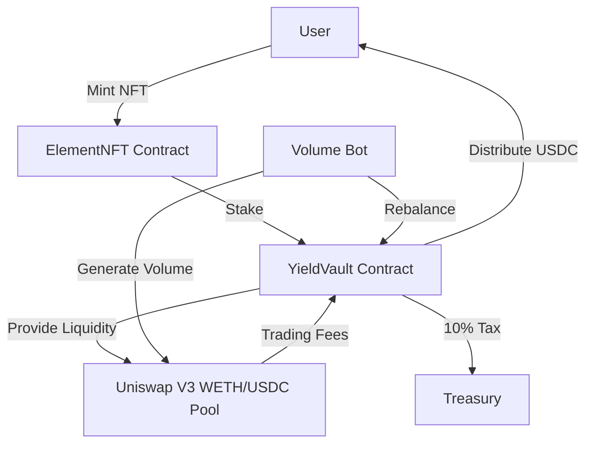
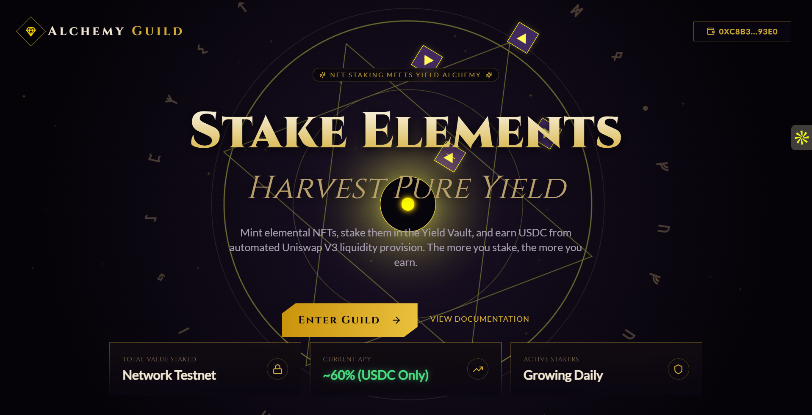
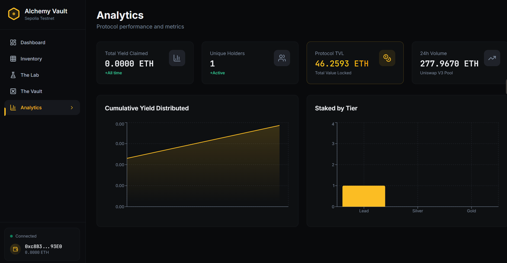

<div align="center">


# ⚗️ Alchemy Guild

**NFT Staking Meets Yield Alchemy**

[](https://sepolia.etherscan.io/)
[]()
[]()

[Live Demo](https://alchemy-guild.vercel.app) | [Documentation](#) | [Report Bug](https://github.com/tmalone1250/alchemy-guild/issues)

</div>

---

## 📖 Overview

**Alchemy Guild** is a DeFi yield generation platform that combines NFT staking with automated Uniswap V3 liquidity provision. Mint elemental NFTs, stake them in the Yield Vault, and earn USDC from trading fees.

### 🎯 Key Features

- 🔮 **Elemental NFTs**: Three rarity tiers (Fire, Water, Earth) with different staking weights
- 💰 **Automated Yield**: Earn USDC from Uniswap V3 trading fees
- ⚡ **Instant Claims**: 20% USDC reserve ensures immediate reward payouts
- 🎨 **Beautiful UI**: Alchemical-themed interface with stunning animations
- 🤖 **24/7 Bot**: Autonomous bot generates volume and manages liquidity

### 📊 Current Stats

| Metric | Value |
|--------|-------|
| **Status** | ✅ Production Ready |
| **Efficiency** | ~60% (USDC fees only) |
| **Network** | Ethereum Sepolia Testnet |
| **Rebalance Success Rate** | 100% |
| **Active Positions** | #223170 |

---

## 🏗️ Architecture



### Core Components

| Component | Description |
|-----------|-------------|
| **ElementNFT** | ERC-721 collection with 3 tiers and evolution mechanics |
| **YieldVault** | Automated Uniswap V3 LP manager & yield distributor |
| **Alchemist** | NFT crafting & evolution system |
| **Treasury** | Receives 10% protocol tax |
| **Volume Bot** | Generates trading volume & triggers rebalances |

---

## 🚀 Quick Start

### Prerequisites

- Node.js 18+
- Foundry (for contracts)
- MetaMask wallet
- Sepolia ETH & USDC

### Installation

```bash
# Clone the repository
git clone https://github.com/tmalone1250/alchemy-guild.git
cd alchemy-guild

# Install dependencies
npm install

# Copy environment file
cp .env.example .env
# Add your PRIVATE_KEY and VITE_INFURA_RPC_URL

# Start development server
npm run dev
```

### Running the Bot

```bash
# Ensure .env is configured
npx tsx volume-bot.ts
```

---

## 📝 Deployed Contracts (Sepolia)

| Contract | Address | Verified |
|----------|---------|----------|
| **ElementNFT** | [`0xF15e4954AE325d68BFF9c990F26269D9c024caF0`](https://sepolia.etherscan.io/address/0xF15e4954AE325d68BFF9c990F26269D9c024caF0) | ✅ |
| **YieldVault** | [`0xFff8e4da589f15453e73004b65c61Da341B9075C`](https://sepolia.etherscan.io/address/0xFff8e4da589f15453e73004b65c61Da341B9075C) | ✅ |
| **Alchemist** | [`0x8f392ccee00369d6623e18E6DDF120E988f3a513`](https://sepolia.etherscan.io/address/0x8f392ccee00369d6623e18E6DDF120E988f3a513) | ✅ |
| **Treasury** | [`0x09b6E39f11C4c26022D10DE50d63C0541ad40227`](https://sepolia.etherscan.io/address/0x09b6E39f11C4c26022D10DE50d63C0541ad40227) | ✅ |

### External Contracts

- **WETH**: `0xfFf9976782d46CC05630D1f6eBAb18b2324d6B14`
- **USDC**: `0x1c7D4B196Cb0C7B01d743Fbc6116a902379C7238`
- **Uniswap V3 Pool**: `0x6Ce0896eAE6D4BD668fDe41BB784548fb8F59b50`

---

## 💎 The Elemental Hierarchy

Alchemy Guild features **18 unique elements** across three tiers, each with distinct staking power and yield potential.

### Tier Classification

| Tier | Classification | Reward Weight | Elements | Border Color |
|------|---------------|---------------|----------|--------------|
| **Tier 1** | � **Lead** (Base Elements) | 10 | 6 elements | Bronze |
| **Tier 2** | ⚪ **Silver** (Advanced Synthesis) | 30 | 6 elements | Silver |
| **Tier 3** | 🟡 **Gold** (Transcendent) | 100 | 6 elements | Gold |

### Complete Element Matrix

<table>
<tr>
<th>Tier 1 (Lead)</th>
<th>Tier 2 (Silver)</th>
<th>Tier 3 (Gold)</th>
</tr>
<tr>
<td>

🌍 **Earth**  
💧 **Water**  
💨 **Wind**  
🔥 **Fire**  
❄️ **Ice**  
⚡ **Lightning**

</td>
<td>

⚛️ **Plasma**  
🌪️ **Tornado**  
🌨️ **Blizzard**  
🌊 **Tsunami**  
🏔️ **Quake**  
🌋 **Inferno**

</td>
<td>

✨ **Holy**  
🌑 **Dark**  
🌀 **Gravity**  
⏰ **Time**  
🧬 **Bio**  
👻 **Spirit**

</td>
</tr>
</table>

---

## ⚗️ The Crafting Lab (Transmutation)

Transform lower-tier NFTs into higher-tier ones through alchemical fusion. **All crafting requires a 0.002 ETH transmutation cost.**

### The Lead Synthesis (Tier 1 → Tier 2)

Combine **3 Tier 1 NFTs** to create **1 Tier 2 NFT**.

**Example Recipes:**
- 💧💧💨 Water + Water + Wind → 🌊 **Tsunami**
- 💨❄️❄️ Wind + Ice + Ice → 🌨️ **Blizzard**
- 🌍🌍🔥 Earth + Earth + Fire → 🏔️ **Quake**
- 💧⚡⚡ Water + Lightning + Lightning → ⚛️ **Plasma**

### The Golden Ritual (Tier 2 → Tier 3)

Combine **3 Tier 2 NFTs** to create **1 Tier 3 NFT**.

**Example Recipes:**
- 🌊🌨️🌨️ Tsunami + Blizzard + Blizzard → ⏰ **Time**
- 🌋🌋🔥 Inferno + Inferno + Fire → 👻 **Spirit**
- 🌪️🌪️⚡ Tornado + Tornado + Lightning → ✨ **Holy**

### Crafting Mechanics

```solidity
function craft(uint256[3] tokenIds) external payable {
    require(msg.value >= 0.002 ether, "Transmutation fee required");
    // Burns 3 NFTs → Mints 1 higher-tier NFT
}
```

**Key Features:**
- ✅ **3-to-1 Ratio**: Burn 3 lower-tier → Create 1 higher-tier
- ✅ **Deflationary**: Reduces total supply with each craft
- ✅ **Specific Recipes**: Each Tier 2/3 element requires exact ingredient combinations
- ✅ **Protocol Fee**: 0.002 ETH per transmutation

---

## 📈 Yield Dynamics & Weight Mathematics

### How Rewards Are Calculated

Yields are distributed **pro-rata** based on each NFT's staking weight:

$$
Reward_{user} = \frac{Weight_{user}}{\sum Weight_{total}} \times Fees_{harvested}
$$

Where:
- $Weight_{user}$ = Sum of all staked NFT weights for the user
- $\sum Weight_{total}$ = Total weight of all staked NFTs in the vault
- $Fees_{harvested}$ = USDC fees collected from Uniswap trading

### Weight Multipliers

| Tier | Weight | Relative Earning Power |
|------|--------|----------------------|
| Tier 1 | 10 | **1x** baseline |
| Tier 2 | 30 | **3x** more than Tier 1 |
| Tier 3 | 100 | **10x** more than Tier 1 |

### Example Scenario

**Vault State:**
- User A: 1× Tier 3 (Gold) NFT = 100 weight
- User B: 3× Tier 2 (Silver) NFTs = 90 weight
- User C: 10× Tier 1 (Lead) NFTs = 100 weight
- **Total Weight:** 290

**Fees Collected:** 100 USDC (after 10% tax to Treasury)

**Distribution:**
- User A: $(100/290) \times 100 = 34.48$ USDC
- User B: $(90/290) \times 100 = 31.03$ USDC
- User C: $(100/290) \times 100 = 34.48$ USDC

> **Key Insight**: User A earns the same as User C, but with **1 NFT vs 10 NFTs**!

### Deflationary Scarcity

Every crafting operation **burns 3 NFTs** to create 1:
- Total supply decreases by 2 NFTs per craft
- Higher-tier NFTs become increasingly scarce
- Remaining stakers capture more yield per NFT over time

$$
Supply_{new} = Supply_{old} - 2
$$

This creates a **flywheel effect**:
1. Users craft to increase individual weight
2. Total NFT supply decreases
3. Yield per NFT increases for all stakers
4. Higher-tier scarcity drives value

---

## 🎮 Usage

### For Users

1. **Mint an NFT**
   - Connect wallet
   - Approve USDC
   - Select tier (1/2/3)
   - Mint NFT

2. **Stake NFT**
   - Navigate to Vault page
   - Click "Stake" on your NFT
   - Confirm transaction

3. **Claim Yields**
   - Wait for rebalances (~5 min cycles)
   - View pending rewards
   - Click "Claim" to receive USDC

### For Developers

#### Deploy Contracts

```bash
cd alchemy-vault
forge build
forge script script/DeployAlchemy.s.sol \
  --rpc-url $VITE_INFURA_RPC_URL \
  --broadcast \
  --private-key $PRIVATE_KEY
```

#### Seed Vault

```bash
npx tsx manual-seed.ts
```

#### Utility Scripts

| Script | Purpose |
|--------|---------|
| `wrap-eth.ts` | Convert ETH → WETH |
| `swap-weth-usdc.ts` | Swap WETH → USDC |
| `check-rewards.ts` | View reward accumulation |
| `test-rebalance.ts` | Test rebalance function |
| `diagnose-rebalance.ts` | Full diagnostic |

---

## 🛠️ Tech Stack

### Smart Contracts
- Solidity 0.8.26
- Foundry (Forge, Cast, Anvil)
- OpenZeppelin Contracts
- Uniswap V3 Core & Periphery

### Frontend
- React 18 + TypeScript
- Vite 5.x
- Ethers.js 6.x
- RainbowKit + Wagmi
- TailwindCSS
- Lucide Icons

### Infrastructure
- Infura (RPC)
- Etherscan (Verification)
- IPFS (Metadata)

---

## 🐛 Known Issues & Solutions

| Issue | Impact | Status | Workaround |
|-------|--------|--------|------------|
| WETH→USDC swap fails in rebalance | 40% lower yield | 🔄 Investigating | Try-catch wrapper prevents crashes |
| WETH fees accumulate | Not distributed | ⏳ Planned | Manual swap available |
| Testnet liquidity | Low fees | ℹ️ Expected | Normal for Sepolia |

---

## 🏆 Major Bugs Fixed

<details>
<summary><b>Click to expand debugging history</b></summary>

### 1. Token Ordering Bug ✅
- **Issue**: WETH and USDC reversed in Uniswap calls
- **Fix**: Corrected to USDC=token0, WETH=token1

### 2. Incorrect Uniswap Addresses ✅
- **Issue**: Wrong Sepolia addresses in deployment
- **Fix**: Updated Position Manager and Swap Router

### 3. Fee Calculation Logic ✅
- **Issue**: Three bugs in fee distribution
- **Fix**: Aligned all variables with token0/token1 ordering

### 4. WETH Swap Failures ✅ (Mitigated)
- **Issue**: Swap reverts during rebalance
- **Fix**: Try-catch wrapper, accumulates WETH safely

### 5. ClaimYield Balance Issue ✅
- **Issue**: USDC locked in Uniswap position
- **Fix**: 20% USDC reserve + balance cap

### 6. Vault Address Mixup ✅
- **Issue**: Bot using wrong contract address
- **Fix**: Updated to correct YieldVault address

</details>

---

## 🔮 Roadmap

### Short Term
- [ ] Fix WETH swap in rebalance context
- [ ] Increase vault liquidity for higher yields
- [ ] Gas optimization
- [ ] Enhanced event logging

### Long Term
- [ ] **Mainnet Deployment** - Real USDC yields
- [ ] **Multi-Pool Support** - ETH/DAI, WBTC/ETH
- [ ] **NFT Marketplace** - Trade staked positions
- [ ] **Governance DAO** - Community parameter control
- [ ] **Advanced Crafting** - Complex evolution recipes

---

## 📸 Screenshots

<div align="center">

### Landing Page


### Dashboard


### Inventory


### The Vault (Staking)


### The Lab (Crafting)


### Analytics


</div>

---

## 🤝 Contributing

Contributions are welcome! Please:

1. Fork the repository
2. Create your feature branch (`git checkout -b feature/AmazingFeature`)
3. Commit your changes (`git commit -m 'Add some AmazingFeature'`)
4. Push to the branch (`git push origin feature/AmazingFeature`)
5. Open a Pull Request

---

## 📄 License

This project is licensed under the MIT License - see the [LICENSE](LICENSE) file for details.

---

## 🙏 Acknowledgments

- [Uniswap V3](https://uniswap.org/) - Decentralized trading protocol
- [OpenZeppelin](https://openzeppelin.com/) - Secure smart contract library
- [Foundry](https://getfoundry.sh/) - Blazing fast Ethereum toolkit
- [RainbowKit](https://rainbowkit.com/) - Best wallet connection UX

---

## 📞 Contact

**Project Maintainer**: [@tmalone1250](https://github.com/tmalone1250)

**Bot Wallet**: `0xd83B5031506039893BF1C827b0A79aDDee71E1fE`

---

<div align="center">

**Built with ⚗️ by Alchemy Guild**

*Transmuting Base Assets into Gold*

[⬆ back to top](#-alchemy-guild)

</div>