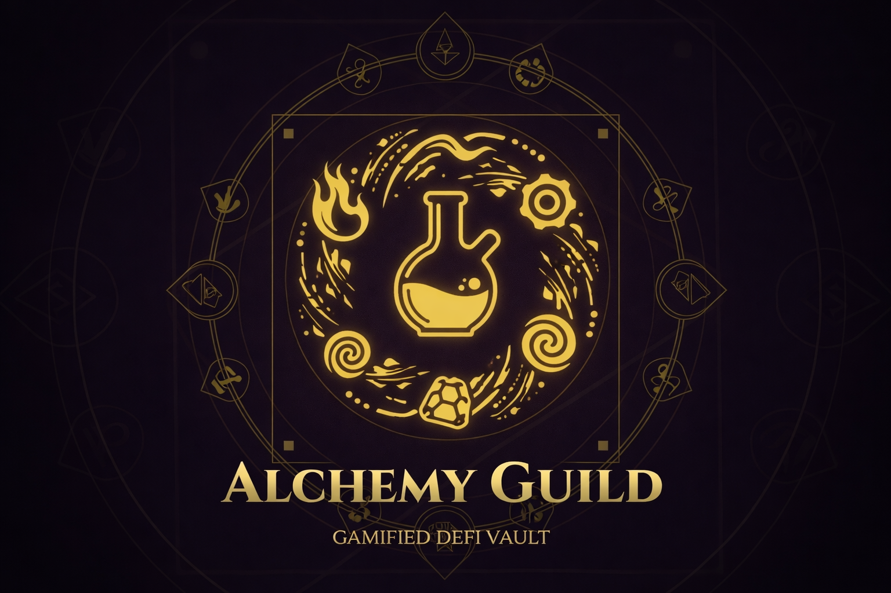
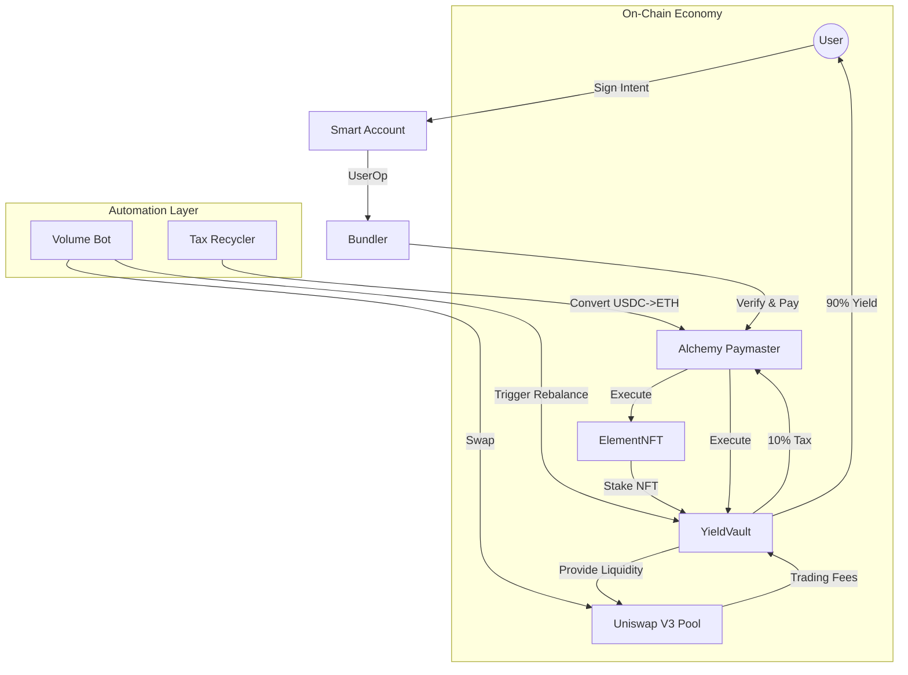
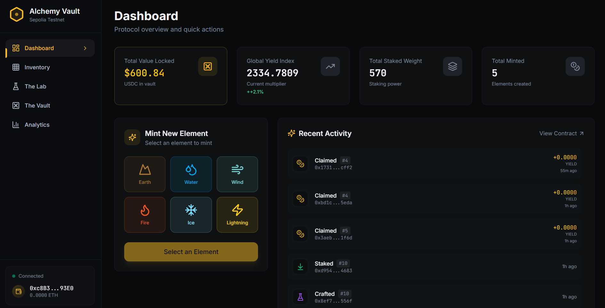
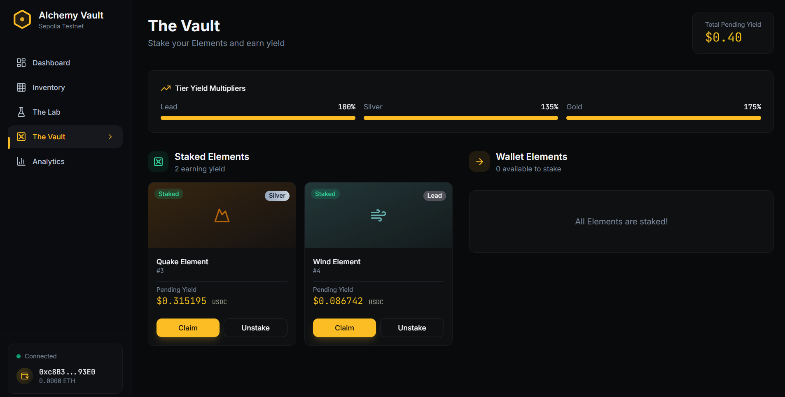
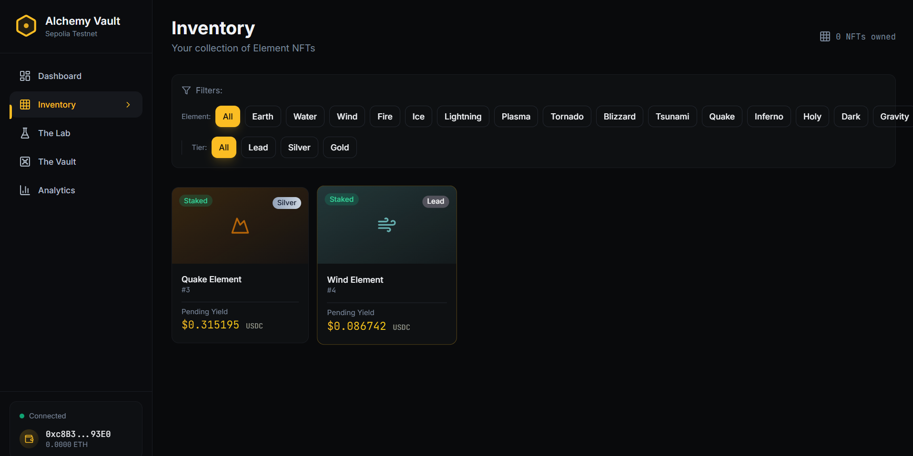

<div align="center">



# ⚗️ Alchemy Guild

**Gamified Yield. Sustainable Sponsorship. Pure Alchemy.**

[](https://sepolia.etherscan.io/)
[]()
[]()

[Live Demo](https://alchemy-guild.vercel.app) | [Documentation (NotebookLM)](./NotebookLM_Source_Complete_Alchemy_Guild.md) | [Report Bug](https://github.com/tmalone1250/alchemy-guild/issues)

</div>

---

## 📖 The Vision

**Alchemy Guild** redefines DeFi by turning boring liquidity provision into an immersive RPG. Instead of just depositing funds, players **Mint, Craft, and Stake** elemental NFTs. The protocol handles the complex financial engineering (Uniswap V3) in the background, while users enjoy a gasless, gamified experience.

### 🌟 Key Features

- **🛡️ Account Abstraction (ERC-4337)**: Users sign intents, and our Paymaster pays the gas. Experience a frictionless "web2-like" journey.
- **💰 Real Yield**: All rewards are paid in **USDC**, generated from real trading fees on Uniswap V3. No inflationary governance tokens.
- **♻️ Sustainable Sponsorship**: A closed-loop economy where protocol taxes (10%) verify and recycle USDC back into ETH to fund user gas fees forever.
- **🔥 Deflationary Crafting**: Burn 3 lower-tier NFTs to create 1 higher-tier NFT. This permanently reduces supply and increases the yield share for remaining players.
- **🤖 Autonomous Agents**:
  - **Volume Bot**: Simulates market activity to generate organic yield.
  - **Tax Recycler**: Converts collected taxes into gas fuel.
  - **Vault Manager**: Auto-rebalances liquidity positions to stay in range.

---

## 🏗️ Architecture



### Core Contracts

| Contract       | Address (Sepolia)                                                                                  | Description                                                           |
| -------------- | -------------------------------------------------------------------------------------------------- | --------------------------------------------------------------------- |
| **ElementNFT** | [`0xF15e4954...`](https://sepolia.etherscan.io/address/0xF15e4954AE325d68BFF9c990F26269D9c024caF0) | ERC-721 Collection. Handles Minting & Tier logic.                     |
| **YieldVault** | [`0xFff8e4da...`](https://sepolia.etherscan.io/address/0xFff8e4da589f15453e73004b65c61Da341B9075C) | The "Bank". Holds funds, manages Uniswap Position, distributes yield. |
| **Paymaster**  | `0x353A1d77...`                                                                                    | Verifying Paymaster. Sponsors gas for game actions.                   |
| **Alchemist**  | [`0x8f392cee...`](https://sepolia.etherscan.io/address/0x8f392ccee00369d6623e18E6DDF120E988f3a513) | Crafting Logic. Burns 3 -> Mints 1.                                   |

---

## 💎 The Gameplay Loop

### 1. Mint (Injection)

Purchase **Tier 1 (Lead)** Elements for `0.002 ETH`.

- _Logic_: The user's ETH is immediately wrapped to WETH and deposited into the Yield Vault to boost the liquidity pool.

### 2. Craft (Transmutation)

Combine elements to increase their rarity and staking weight.

- **Recipe**: 3x Tier `N` Elements = 1x Tier `N+1` Element.
- **Cost**: `0.002 ETH` (Protocol Fee -> Liquidity).

| Tier  | Name   | Weight | Multiplier |
| ----- | ------ | ------ | ---------- |
| **1** | Lead   | 10     | 1x         |
| **2** | Silver | 30     | 3x         |
| **3** | Gold   | 100    | **10x**    |

### 3. Stake (Yield)

Lock your NFTs in the Vault. The Vault calculates your share of the pool's trading fees based on your total Staking Weight versus the Global Weight.

---

## 🚀 Quick Start

### Prerequisites

- Node.js 18+
- Sepolia ETH (for manual bot funding)
- A browser with MetaMask (optional, for signing)

### Installation

```bash
# Clone the repository
git clone https://github.com/tmalone1250/alchemy-guild.git
cd alchemy-guild

# Install dependencies
npm install

# Setup Environment
cp .env.example .env
# Fill in VITE_PIMLICO_API_KEY, VITE_INFURA_RPC_URL, PRIVATE_KEY
```

### Running Locally

```bash
npm run dev
```

### Verification Scripts

We include a suite of scripts to verify the on-chain state:

```bash
# Check Bot Status
npx tsx volume-bot.ts

# Run Tax Recycler
npx tsx recycle-paymaster-tax.ts

# Verify NFT Valuation
npx node scripts/diagnostics/check-nft-value.cjs
```

---

## 🛠️ Tech Stack

### Frontend

- **Framework**: React + Vite (TypeScript)
- **Styling**: TailwindCSS + Shadcn/UI
- **Web3**: Wagmi v2 + Viem + TanStack Query
- **Auth**: Reown AppKit

### Account Abstraction

- **SDK**: Permissionless.js
- **Provider**: Pimlico (Bundler & Paymaster)
- **Standard**: ERC-4337

### Smart Contracts

- **Language**: Solidity 0.8.26
- **Framework**: Foundry (Forge)
- **Libraries**: OpenZeppelin, Uniswap V3 Core/Periphery

---

## 📸 Screenshots

<div align="center">
  
  
</div>

<div align="center">
  
  
</div>

---

## 📄 License

This project is licensed under the MIT License - see the [LICENSE](LICENSE) file for details.

---

<div align="center">
  <h3>Transmuting Base Assets into Gold.</h3>
  <p>Built with ❤️ for the Metana Capstone.</p>
</div>
