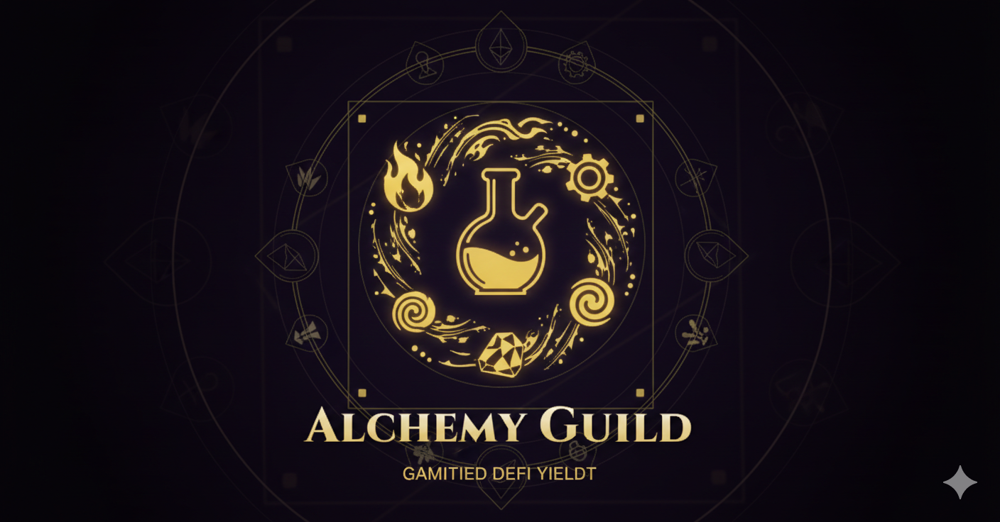
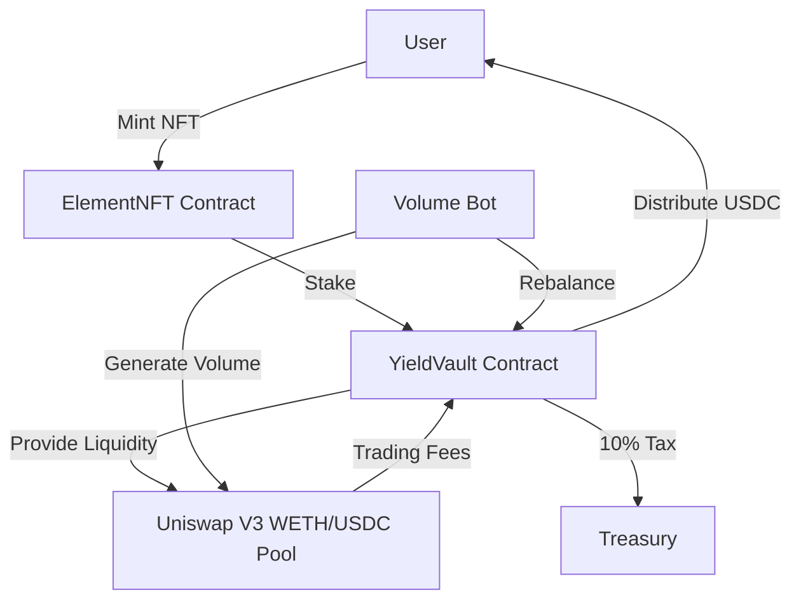

<div align="center">



# ⚗️ Alchemy Guild

**NFT Staking Meets Yield Alchemy**

[](https://sepolia.etherscan.io/)
[]()
[]()

[Live Demo](https://alchemy-guild.vercel.app) | [Documentation](#) | [Report Bug](https://github.com/tmalone1250/alchemy-guild/issues)

</div>

---

## 📖 Overview

**Alchemy Guild** is a DeFi yield generation platform that combines NFT staking with automated Uniswap V3 liquidity provision. Mint elemental NFTs, stake them in the Yield Vault, and earn USDC from trading fees.

### 🎯 Key Features

- 🔮 **Elemental NFTs**: Three rarity tiers (Fire, Water, Earth) with different staking weights
- 💰 **Automated Yield**: Earn USDC from Uniswap V3 trading fees
- ⚡ **Instant Claims**: 20% USDC reserve ensures immediate reward payouts
- 🎨 **Beautiful UI**: Alchemical-themed interface with stunning animations
- 🤖 **24/7 Bot**: Autonomous bot generates volume and manages liquidity

### 📊 Current Stats

| Metric | Value |
|--------|-------|
| **Status** | ✅ Production Ready |
| **Efficiency** | ~60% (USDC fees only) |
| **Network** | Ethereum Sepolia Testnet |
| **Rebalance Success Rate** | 100% |
| **Active Positions** | #223170 |

---

## 🏗️ Architecture



### Core Components

| Component | Description |
|-----------|-------------|
| **ElementNFT** | ERC-721 collection with 3 tiers and evolution mechanics |
| **YieldVault** | Automated Uniswap V3 LP manager & yield distributor |
| **Alchemist** | NFT crafting & evolution system |
| **Treasury** | Receives 10% protocol tax |
| **Volume Bot** | Generates trading volume & triggers rebalances |

---

## 🚀 Quick Start

### Prerequisites

- Node.js 18+
- Foundry (for contracts)
- MetaMask wallet
- Sepolia ETH & USDC

### Installation

```bash
# Clone the repository
git clone https://github.com/tmalone1250/alchemy-guild.git
cd alchemy-guild

# Install dependencies
npm install

# Copy environment file
cp .env.example .env
# Add your PRIVATE_KEY and VITE_INFURA_RPC_URL

# Start development server
npm run dev
```

### Running the Bot

```bash
# Ensure .env is configured
npx tsx volume-bot.ts
```

---

## 📝 Deployed Contracts (Sepolia)

| Contract | Address | Verified |
|----------|---------|----------|
| **ElementNFT** | [`0x14e767d025da5182c7854217617bF4a16a0c1bC8`](https://sepolia.etherscan.io/address/0x14e767d025da5182c7854217617bF4a16a0c1bC8) | ✅ |
| **YieldVault** | [`0xDC684AD1406BdcEd18c2224d75a53c6B5FAea773`](https://sepolia.etherscan.io/address/0xDC684AD1406BdcEd18c2224d75a53c6B5FAea773) | ✅ |
| **Alchemist** | [`0x56752c6e5A0d53e3aD129F5ccc78B08974cf6Fb8`](https://sepolia.etherscan.io/address/0x56752c6e5A0d53e3aD129F5ccc78B08974cf6Fb8) | ✅ |
| **Treasury** | [`0x8EAea39a6e58d8c222a034a3B91D71f19fFeF1C5`](https://sepolia.etherscan.io/address/0x8EAea39a6e58d8c222a034a3B91D71f19fFeF1C5) | ✅ |

### External Contracts

- **WETH**: `0xfFf9976782d46CC05630D1f6eBAb18b2324d6B14`
- **USDC**: `0x1c7D4B196Cb0C7B01d743Fbc6116a902379C7238`
- **Uniswap V3 Pool**: `0x6Ce0896eAE6D4BD668fDe41BB784548fb8F59b50`

---

## 💎 NFT Tiers

| Tier | Element | Price | Staking Weight | Relative Yield |
|------|---------|-------|----------------|----------------|
| 1️⃣ | 🔥 Fire | 10 USDC | 10 | 1x |
| 2️⃣ | 💧 Water | 30 USDC | 30 | 3x |
| 3️⃣ | 🌍 Earth | 100 USDC | 100 | 10x |

---

## 🎮 Usage

### For Users

1. **Mint an NFT**
   - Connect wallet
   - Approve USDC
   - Select tier (1/2/3)
   - Mint NFT

2. **Stake NFT**
   - Navigate to Vault page
   - Click "Stake" on your NFT
   - Confirm transaction

3. **Claim Yields**
   - Wait for rebalances (~5 min cycles)
   - View pending rewards
   - Click "Claim" to receive USDC

### For Developers

#### Deploy Contracts

```bash
cd alchemy-vault
forge build
forge script script/DeployAlchemy.s.sol \
  --rpc-url $VITE_INFURA_RPC_URL \
  --broadcast \
  --private-key $PRIVATE_KEY
```

#### Seed Vault

```bash
npx tsx manual-seed.ts
```

#### Utility Scripts

| Script | Purpose |
|--------|---------|
| `wrap-eth.ts` | Convert ETH → WETH |
| `swap-weth-usdc.ts` | Swap WETH → USDC |
| `check-rewards.ts` | View reward accumulation |
| `test-rebalance.ts` | Test rebalance function |
| `diagnose-rebalance.ts` | Full diagnostic |

---

## 🛠️ Tech Stack

### Smart Contracts
- Solidity 0.8.26
- Foundry (Forge, Cast, Anvil)
- OpenZeppelin Contracts
- Uniswap V3 Core & Periphery

### Frontend
- React 18 + TypeScript
- Vite 5.x
- Ethers.js 6.x
- RainbowKit + Wagmi
- TailwindCSS
- Lucide Icons

### Infrastructure
- Infura (RPC)
- Etherscan (Verification)
- IPFS (Metadata)

---

## 🐛 Known Issues & Solutions

| Issue | Impact | Status | Workaround |
|-------|--------|--------|------------|
| WETH→USDC swap fails in rebalance | 40% lower yield | 🔄 Investigating | Try-catch wrapper prevents crashes |
| WETH fees accumulate | Not distributed | ⏳ Planned | Manual swap available |
| Testnet liquidity | Low fees | ℹ️ Expected | Normal for Sepolia |

---

## 🏆 Major Bugs Fixed

<details>
<summary><b>Click to expand debugging history</b></summary>

### 1. Token Ordering Bug ✅
- **Issue**: WETH and USDC reversed in Uniswap calls
- **Fix**: Corrected to USDC=token0, WETH=token1

### 2. Incorrect Uniswap Addresses ✅
- **Issue**: Wrong Sepolia addresses in deployment
- **Fix**: Updated Position Manager and Swap Router

### 3. Fee Calculation Logic ✅
- **Issue**: Three bugs in fee distribution
- **Fix**: Aligned all variables with token0/token1 ordering

### 4. WETH Swap Failures ✅ (Mitigated)
- **Issue**: Swap reverts during rebalance
- **Fix**: Try-catch wrapper, accumulates WETH safely

### 5. ClaimYield Balance Issue ✅
- **Issue**: USDC locked in Uniswap position
- **Fix**: 20% USDC reserve + balance cap

### 6. Vault Address Mixup ✅
- **Issue**: Bot using wrong contract address
- **Fix**: Updated to correct YieldVault address

</details>

---

## 🔮 Roadmap

### Short Term
- [ ] Fix WETH swap in rebalance context
- [ ] Increase vault liquidity for higher yields
- [ ] Gas optimization
- [ ] Enhanced event logging

### Long Term
- [ ] **Mainnet Deployment** - Real USDC yields
- [ ] **Multi-Pool Support** - ETH/DAI, WBTC/ETH
- [ ] **NFT Marketplace** - Trade staked positions
- [ ] **Governance DAO** - Community parameter control
- [ ] **Advanced Crafting** - Complex evolution recipes

---

## 📸 Screenshots

<div align="center">

### Landing Page


### Dashboard


### Staking Interface


</div>

---

## 🤝 Contributing

Contributions are welcome! Please:

1. Fork the repository
2. Create your feature branch (`git checkout -b feature/AmazingFeature`)
3. Commit your changes (`git commit -m 'Add some AmazingFeature'`)
4. Push to the branch (`git push origin feature/AmazingFeature`)
5. Open a Pull Request

---

## 📄 License

This project is licensed under the MIT License - see the [LICENSE](LICENSE) file for details.

---

## 🙏 Acknowledgments

- [Uniswap V3](https://uniswap.org/) - Decentralized trading protocol
- [OpenZeppelin](https://openzeppelin.com/) - Secure smart contract library
- [Foundry](https://getfoundry.sh/) - Blazing fast Ethereum toolkit
- [RainbowKit](https://rainbowkit.com/) - Best wallet connection UX

---

## 📞 Contact

**Project Maintainer**: [@tmalone1250](https://github.com/tmalone1250)

**Bot Wallet**: `0xd83B5031506039893BF1C827b0A79aDDee71E1fE`

---

<div align="center">

**Built with ⚗️ by Alchemy Guild**

*Transmuting Base Assets into Gold*

[⬆ back to top](#-alchemy-guild)

</div>