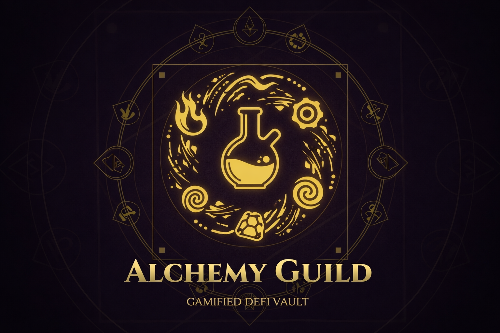

<div align="center">



# ⚗️ Alchemy Guild
### **Gamified DeFi Yield, Sustainable Gas Sponsorship, & Confidential Enclave Governance via iExec Nox**

[-28A0F0?style=for-the-badge&logo=arbitrum)](https://sepolia.arbiscan.io/)
[](https://iex.ec/)
[](https://pimlico.io/)
[](https://book.getfoundry.sh/)

[Live Application](https://alchemy-guild.vercel.app) • [Architecture Overview](#%EF%B8%8F-system-architecture) • [Verified Contracts](#-verified-contract-addresses-arbitrum-sepolia) • [Confidential Governance](#-iexec-nox-confidential-tee-governance)

</div>

---

## 🌟 Executive Summary

**Alchemy Guild** transforms liquidity provision into an immersive, gasless RPG economy while pioneering **Confidential TEE Governance** and **MEV-Protected Liquidity Rebalancing** using the **iExec Nox Protocol** on **Arbitrum Sepolia**.

Rather than navigating complex DeFi pool management, players **Mint, Craft, and Stake** elemental NFTs (`Lead`, `Silver`, `Gold`). Behind the scenes, the protocol manages underlying **Uniswap V3** liquidity, automatically harvesting real **USDC trading fees** and distributing yield directly to NFT stakers. Every transaction is 100% gasless via **ERC-4337 Smart Account Abstraction** sponsored by our self-sustaining protocol tax paymaster.

---

## 🔒 iExec Nox Confidential TEE Governance (`GuildDAO` + `cGUILD`)

Public blockchain governance (`ERC-20` snapshot voting) suffers from two fundamental flaws: **voter intimidation/bribery** and **governance front-running**. Whales can see exact live vote tallies and swing outcomes at the last block, or copy trading strategies before proposals execute.

**Alchemy Guild solves this with a 3-layer confidential TEE architecture:**

```mermaid
graph TD
    User([User Smart Account]) -->|1. Shield GUILD| cGUILD[cGUILD Enclave Contract]
    cGUILD -->|Mint euint256 Handle| User
    User -->|2. Cast Vote: Burn 10 cGUILD| DAO[GuildDAO.sol]
    DAO -->|3. Push Encrypted Vote Handle| Enclave[Intel TDX Enclave / TEE Runner]
    
    subgraph "Active Voting Window (3 Days)"
        DAO -.-|Public Mempool View| Secret[Encrypted Tally: N Handles Recorded\nPlaintext Split: HIDDEN 🔒]
    end
    
    subgraph "Proposal Resolution & Delegation"
        Enclave -->|4. Decrypt inside Hardware TEE| Result[Compute totalFor vs totalAgainst]
        Result -->|5. Verify & Execute| DAO
        User -.->|Grant O(1) Viewing Access| Leno[Leno AI Enclave v2 Agent]
    end
```

### 1. The Shielding Lab (`cGUILD` Wrapper)
Users deposit standard `GUILD` governance tokens into the **Shielding Lab** inside the dashboard. The `cGUILD` contract (`0xD32B...`) calls `Nox.toEuint256(...)` to mint confidential handles (`euint256`), completely obfuscating token wealth from public blockchain explorers.

### 2. Confidential Proposals (`PROPOSAL_THRESHOLD = 500 cGUILD`)
To submit a proposal (`GuildDAO.createProposal`), a user must hold at least **500 `cGUILD`**. During submission, `cGUILD.spendForGovernance(500e18, ...)` verifies the encrypted balance within the Intel TDX enclave without revealing exact holdings, while granting the TEE Enclave Master Key (`grantAccess`) access to verify proposal authenticity.

### 3. Sealed Ballot Voting (`VOTE_COST = 10 cGUILD`)
When a user clicks **Upvote** (`Support / FOR`) or **Downvote** (`Reject / AGAINST`):
- `GuildDAO.castVote(proposalId, support)` is executed via a gasless ERC-4337 UserOp.
- Exactly `10 cGUILD` (`Nox.toEuint256(10e18)`) is burned from the voter's confidential handle.
- A new encrypted vote handle (`euint256`) is generated and pushed to `proposal.voteHandles`.
- **Sealed Tally:** During the 3-day voting period (`!proposal.executed`), the public contract only reports `{proposal.voteHandlesCount} Encrypted Vote Handles Sealed`. Plaintext `totalFor` and `totalAgainst` percentages remain zero on-chain, eliminating bandwagon effects and frontrunning.

### 4. TEE Resolution (`executeProposalResult`)
Once the voting period concludes (`block.timestamp > proposal.endTime`), the authorized **Intel TDX Enclave Runner (`0x1d...`)** calls `executeProposalResult`. The hardware enclave decrypts all collected vote handles inside isolated enclave memory, tallies exact FOR and AGAINST weights, and publishes the cryptographic `teeProof` along with the final resolved percentage split.

### 5. Autonomous AI Enclave Delegation (`Leno AI v2`)
Members can delegate `O(1)` encrypted viewing rights (`cGUILD.grantAccess(delegateAgentAddress)`) directly to whitelisted autonomous agent enclaves (e.g., **Leno AI Enclave v2**: `0x5e4B...` / `0x98bF...`). The agent can securely analyze sentiment and cast programmatic votes inside the TEE without ever leaking voter balances or strategies to the mempool.

---

## 🎮 The Gamified Economy & Real Yield

### 1. Minting (`ElementNFT.sol` + `YieldVault.sol`)
- Players inject **`0.002 ETH`** into the protocol to mint a **Tier I (Lead)** elemental NFT (`Earth`, `Water`, `Wind`, `Fire`, `Ice`, `Lightning`).
- **DeFi Engine:** The `0.002 ETH` is immediately wrapped to `WETH` and deposited directly into the active **Uniswap V3 WETH/USDC Liquidity Pool** managed by `YieldVault`.

### 2. Crafting & Transmutation (`Alchemist.sol`)
To increase yield share and rarity, players combine lower-tier NFTs into higher-tier elemental artifacts:
- **Recipe:** Burn **3x Tier `N` NFTs** + pay **`0.002 ETH`** crafting fee $\rightarrow$ Mint **1x Tier `N+1` NFT**.
- **Deflationary Flywheel:** Crafting permanently burns 3 NFTs from circulation, compressing supply while multiplying the owner's staking weight.

| Tier | Rarity | Base Elements | Staking Weight | Multiplier |
| :---: | :---: | :--- | :---: | :---: |
| **I** | **Lead** | Earth, Water, Wind, Fire, Ice, Lightning | `100` | **1x** |
| **II** | **Silver** | Plasma, Tornado, Blizzard, Tsunami, Quake, Inferno | `135` | **1.35x** |
| **III** | **Gold** | Holy, Dark, Gravity, Time, Bio, Spirit | `175` | **1.75x** |

### 3. Staking & Real USDC Harvest (`YieldVault.sol` + `GuildDistributor.sol`)
When players stake their elemental NFTs inside **The Vault**:
- `YieldVault` tracks the user's total active weight versus the `globalTotalWeight`.
- As traders swap on Uniswap V3, real **USDC trading fees** accrue to the vault.
- `YieldVault.harvestAndDistribute()` pushes **90% of all harvested USDC** into `GuildDistributor` for stakers to claim instantly, and routes **10%** to the **Protocol Tax Paymaster** to perpetually fund user gas.

---

## 🤖 Autonomous Agents & MEV-Protected Bots

Alchemy Guild operates as a fully autonomous, self-sustaining financial machine through three specialized background bots:

1. **Confidential Rebalance Bot (`iexec-nox-rebalancer`)**
   - Monitors `YieldVault` Uniswap V3 liquidity positions.
   - When out of range, target ticks (`lowerTick`, `upperTick`) are **encrypted via iExec Nox** inside a confidential payload before triggering `YieldVault.rebalance(...)`. This ensures MEV searchers cannot sandwich the protocol's liquidity adjustments.
2. **Tax Recycler (`recycle-paymaster-tax.ts`)**
   - Continuously sweeps the `10%` USDC protocol tax harvested from `YieldVault`.
   - Executes optimal Uniswap V3 swaps from `USDC` $\rightarrow$ `ETH` and deposits directly into the **Alchemy / Pimlico Verifying Paymaster (`0xa992...`)** on Arbitrum Sepolia.
3. **Organic Volume Simulator (`volume-bot.ts`)**
   - Simulates continuous, realistic retail trading volume across the `WETH/USDC` Uniswap V3 pool on Arbitrum Sepolia, guaranteeing steady, organic USDC fee accrual for NFT stakers.

---

## 🏗️ Verified Contract Addresses (Arbitrum Sepolia)

All core contracts and TEE enclaves are deployed and verified on **Arbitrum Sepolia (`Chain ID: 421614`)**:

| Contract Name | Verified Address | Description |
| :--- | :---: | :--- |
| **YieldVault** | [`0x2Ed51bD2CD7148197C8aBbF53D171e1c8bb41CdC`](https://sepolia.arbiscan.io/address/0x2Ed51bD2CD7148197C8aBbF53D171e1c8bb41CdC) | Core Bank, Uniswap V3 Position Manager, & Fee Harvester |
| **GuildToken (GUILD)** | [`0x39514660f913E651E098c710b03943bA5F451535`](https://sepolia.arbiscan.io/address/0x39514660f913E651E098c710b03943bA5F451535) | Native ERC-20 Governance Token (`100,000,000 GUILD` cap) |
| **cGUILD (iExec Nox Wrapper)** | [`0xD32B7929146E484eac13e59D0a0Ca116707CD286`](https://sepolia.arbiscan.io/address/0xD32B7929146E484eac13e59D0a0Ca116707CD286) | Confidential TEE Wrapper (`euint256` balances & burn/spend logic) |
| **GuildDAO** | [`0x11feE910D4d026ca7CC951ee0836a2094b898aC7`](https://sepolia.arbiscan.io/address/0x11feE910D4d026ca7CC951ee0836a2094b898aC7) | Enclave Governance Engine (`createProposal`, `castVote`, `execute`) |
| **ElementNFT** | [`0x60c28DcF0c32bd305b49a3dCcABC1A4a10BdcBc3`](https://sepolia.arbiscan.io/address/0x60c28DcF0c32bd305b49a3dCcABC1A4a10BdcBc3) | ERC-721 Collection (`Tier I`, `II`, `III` elemental attributes) |
| **Alchemist** | [`0xB20fCfFa104Ff37eA2ba3df54AC55379D4167765`](https://sepolia.arbiscan.io/address/0xB20fCfFa104Ff37eA2ba3df54AC55379D4167765) | Crafting & Transmutation Engine (3-to-1 burn mechanics) |
| **GuildDistributor** | [`0x1d64980f2Dc19e7A38666e23Fcb443529222cdf6`](https://sepolia.arbiscan.io/address/0x1d64980f2Dc19e7A38666e23Fcb443529222cdf6) | Pro-rata USDC Yield Streamer for NFT Stakers |
| **Verifying Paymaster** | [`0xa9924829148A1a1Bd057EAC11B448084cDCbC60a`](https://sepolia.arbiscan.io/address/0xa9924829148A1a1Bd057EAC11B448084cDCbC60a) | ERC-4337 Pimlico / Alchemy Paymaster (`0.00 ETH` gas operations) |
| **WETH (Arbitrum Sepolia)** | [`0x980B62Da83eFf3D4576C647993b0c1D7faf17c73`](https://sepolia.arbiscan.io/address/0x980B62Da83eFf3D4576C647993b0c1D7faf17c73) | Base Wrapped Ether Liquidity Asset |
| **USDC (Arbitrum Sepolia)** | [`0x75faf114eafb1BDbe2F0316DF893fd58CE46AA4d`](https://sepolia.arbiscan.io/address/0x75faf114eafb1BDbe2F0316DF893fd58CE46AA4d) | Real Yield & Reward Asset |
| **Leno AI Enclave v2** | `0x5e4B314B15DEB44e5E7dC688537F55fD72A3ffbb` | Whitelisted Intel TDX Autonomous Agent Enclave Runner |

---

## 🚀 Quick Start & Development Guide

### 1. Prerequisites
- **Node.js** v18+ (`npm` or `pnpm`)
- **Foundry** (`forge`, `cast`, `anvil`)
- **Arbitrum Sepolia ETH** (only needed for deployer/treasury wallet operations; all user operations are sponsored via Paymaster).

### 2. Clone & Setup
```bash
git clone https://github.com/tmalone1250/alchemy-guild.git
cd alchemy-guild

# Install Frontend Dependencies
npm install

# Setup Environment Variables
cp .env.example .env
```

Ensure your `.env` contains:
```ini
VITE_PIMLICO_API_KEY=your_pimlico_api_key
VITE_RPC_URL=https://sepolia-rollup.arbitrum.io/rpc
PRIVATE_KEY=your_deployer_or_bot_private_key
```

### 3. Running the Web Application Locally
```bash
npm run dev
```
Open `http://localhost:5173` in your browser. Connect any Web3 wallet (MetaMask, Rabby, Reown AppKit); the application automatically provisions and connects your **Gasless Smart Account (ERC-4337)**.

### 4. Smart Contract Testing & Compilation (`alchemy-vault`)
```bash
cd ../alchemy-vault
forge build
forge test -vvv
```

### 5. Running Autonomous Bots (`alchemy-guild`)
```bash
# Run Organic Volume Simulator (Swaps WETH <-> USDC on Uniswap V3)
npx tsx volume-bot.ts

# Run Tax Recycler (Converts harvested USDC tax to ETH -> deposits to Paymaster)
npx tsx recycle-paymaster-tax.ts
```

---

## 🛠️ Technology Stack

- **Frontend Application:** React 18, Vite, TypeScript, Tailwind CSS, Shadcn/UI, Lucide Icons.
- **Web3 & Account Abstraction:** Wagmi v2, Viem v2, TanStack Query, Permissionless.js v0.1.33 (`smartAccountClient`), Reown / WalletConnect AppKit.
- **Confidentiality Engine:** **iExec Nox Protocol** (`euint256`, `euint32`, `Nox.allow`, `Nox.allowThis`, confidential TEE runner `executeProposalResult`).
- **Smart Contracts:** Solidity 0.8.26, Foundry Forge, OpenZeppelin v5, Uniswap V3 Core & Periphery (`NonfungiblePositionManager`).

---

## 📸 Core User Flows

1. **Connect & Provision:** Connect wallet $\rightarrow$ Automatic Smart Account deployment on Arbitrum Sepolia (`0.00 ETH` gas).
2. **The Laboratory:** Click **Mint Element (`0.002 ETH`)** to inject liquidity and receive Tier I Lead NFTs. Select 3 matching elements and click **Craft Tier II / III** to transmute into high-weight artifacts.
3. **The Vault:** Deposit (`Stake`) your NFTs into the `YieldVault` to begin earning continuous pro-rata USDC real yield. Click **Harvest & Claim** anytime.
4. **The Guild Hall (Confidential Governance):**
   - **Shielding Lab:** Convert public `GUILD` tokens into confidential `cGUILD` (`euint256`).
   - **Active Proposals (`AIP-1`):** Click **Upvote (`Support`)** or **Downvote (`Reject`)**. Exactly `10 cGUILD` is burned from your secret handle while your vote weight is sealed inside the **Intel TDX Enclave**.
   - **AI Delegation:** Delegate `O(1)` encrypted viewing rights (`grantAccess`) to whitelisted AI Agent enclaves (`Leno AI v2`) for autonomous governance execution.

---

<div align="center">
  <h3><b>Transmuting Base Assets & Plaintext State into Gold & Confidentiality.</b></h3>
  <p>Built with ❤️ for the WTF!! Summer Hackathon & Metana Capstone.</p>
</div>
